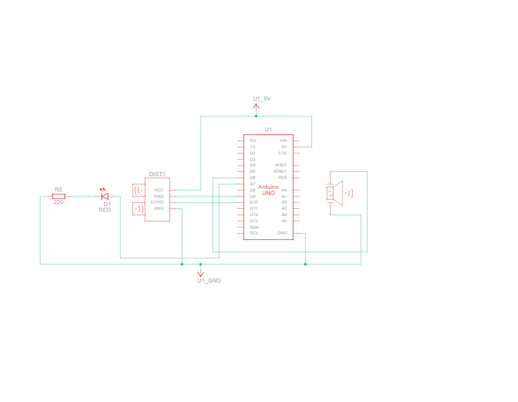
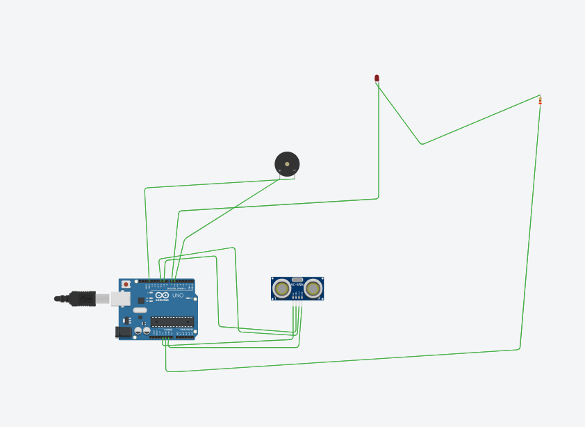

# Ultrasonic-sensor
This project measures the distance of objects using  an ultrasonic sensor and Arduino UNO and displays the result in real time on serial monitor or LED.
## Components Used
- HC-SR04 Ultrasonic Sensor
- Arduino Uno
- LED
- Jumper wires
- Buzzer
## Circuit Diagram

## Connection Diagram

## Demo Video
[Click here to view demo video](Ultrasonicsensor_Demovideo.mp4)
